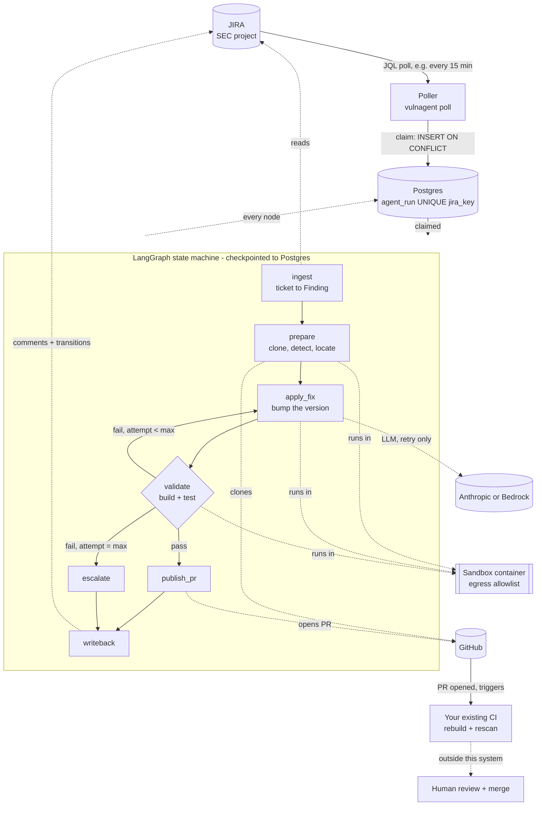
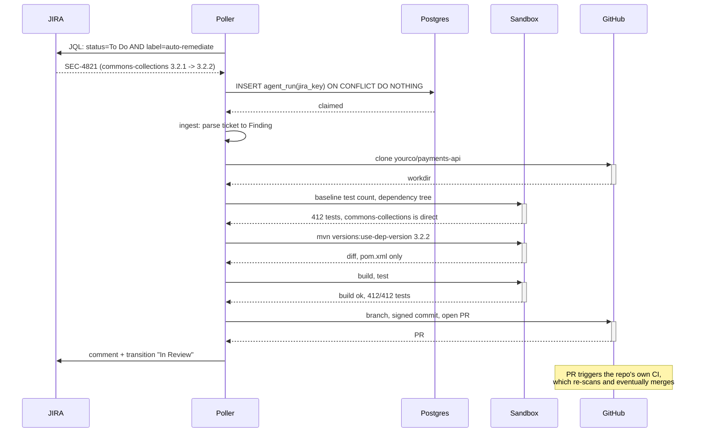
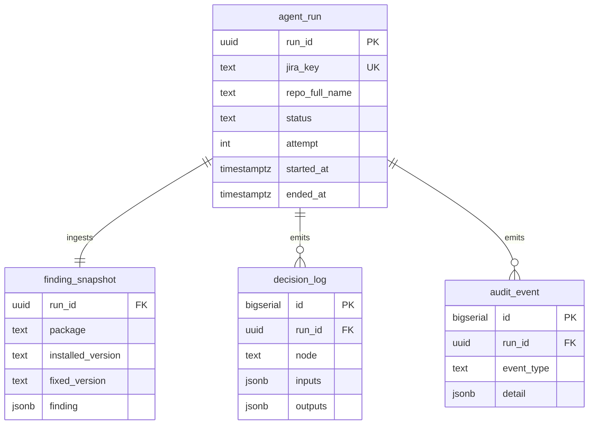

# Design document — vulnagent (simplified)

Fix JIRA-filed security findings: bump the dependency, build, test, open a
PR. The ticket lists (repo, CVE link) rows; the system clones the repo,
resolves the affected package and fixed version from the CVE link (OSV), then
applies the fix — it does not judge *whether* a fix is worth making.

## What changed from the original design

| Removed | Because |
|---|---|
| Reachability analysis (call-graph scanning) | the ticket already says what to fix |
| OSV / EPSS / CISA KEV enrichment | the ticket already has the fixed version |
| Risk tiering, autonomy matrix | one strategy (bump) needs no selection |
| Rescan-and-diff validation | your PR pipeline re-scans on the PR |
| Suppression flow | nothing here judges exploitability, so nothing suppresses |
| JIRA webhook, Redis, ARQ | ingestion is now a poll; a `UNIQUE` constraint in Postgres is the whole dedup mechanism a poll needs |

What stayed: the LLM still never decides control flow, deterministic tooling
still runs before any model call, and nothing ships without a build+test
pass. The audit trail is unchanged in kind, just smaller in scope.

## Non-goals

- Verifying the fix actually resolves the CVE. That's your CI pipeline's
  re-scan, and it happens after this system's job is done.
- Judging whether a finding is worth fixing. The ticket already answered that.
- Any strategy besides a dependency-version bump.

---

## 1. End-to-end flow

Two things worth noticing:

1. **The LLM is called from exactly one place** — `apply_fix`, and only on a
   retry, when the mechanical bump has already broken the build. On the
   common path (bump compiles cleanly), no model call happens at all.
2. **The system's job ends at "PR opened."** The dashed box on the right —
   your CI pipeline and the human merge — is what actually confirms the fix
   and closes the security loop. `writeback` says this explicitly in the
   JIRA comment so "Done" isn't misread as "verified."

---

## 2. Sequence, happy path

---

## 3. External dependencies

| System | Purpose | Credential | If unavailable |
|---|---|---|---|
| **JIRA** | ticket source, ticket sink | API token, service account, scoped to one project | poller finds nothing; escalated tickets can't be commented on |
| **GitHub** | clone, branch, PR | GitHub App: app ID, installation ID, `.pem` | no fixes ship |
| **Anthropic or Bedrock** | break-fix retry, escalation notes only | API key, or AWS Bedrock model access | mechanical bumps still work; a broken build after bump escalates immediately instead of getting a retry |
| **Postgres** | run tracking, audit, dedup, checkpoints | connection string | total outage |
| **Docker / sandbox runtime** | isolated build execution | runtime access | no execution |
| **Your CI pipeline** | re-scans and ultimately verifies the fix | — (not called by this system) | **the PR still opens, but nothing confirms the CVE is actually gone — this is the one dependency this design takes entirely on trust** |

No OSV, no EPSS, no CISA KEV, no scanner CLI in the sandbox — none are
called. Package registries (Maven Central, npm, PyPI) are still needed to
actually download the bumped version.

### The one assumption this whole design rests on

Your PR pipeline's re-scan is what turns "a PR is open" into "the
vulnerability is fixed." This system never checks that the re-scan ran, or
that it passed — it can't see your CI at all. If that pipeline is ever
disabled, skipped, or misconfigured for a given repo, a PR could merge
without the fix ever being confirmed. Worth a periodic check that it's
actually wired the way you expect, since this system has no way to notice if
it isn't.

---

## 4. Data model

`jira_key` carries a `UNIQUE` constraint — that single line is the entire
idempotency mechanism. `audit_event` is INSERT-only at the database level
(`REVOKE UPDATE, DELETE`).

---

## 5. Failure modes

| Failure | Response |
|---|---|
| Same ticket seen on two poll cycles | second `INSERT` conflicts, silently skipped |
| Two tickets, same repo | process sequentially (see `poller.py`'s concurrency note) |
| Pod restart mid-run | LangGraph checkpoint resumes from the last node |
| Ticket missing a required field | escalate, never guess |
| Unrecognised ecosystem | escalate, never guess a build command |
| Mechanical bump fails to compile | retry with LLM break-fix, bounded by `VA_MAX_FIX_ATTEMPTS` |
| Patch deletes a test | hard fail via `tests_not_deleted`, no retry |
| LLM output isn't a valid diff | hard fail, never applied speculatively |
| Retries exhausted | escalate — JIRA comment + hand-off note, ticket transitioned |
| Runaway LLM cost | daily token budget halts and escalates |
| Systemic problem | kill switch |

---

## 6. What this design deliberately does not verify

- That the fixed version actually resolves the CVE (trusts the ticket)
- That the dependency bump didn't introduce a *different* vulnerability
  (that's your re-scan's job)
- That the PR, once merged, was actually deployed

Each of these is a reasonable thing to add later — reintroducing a
rescan-and-diff validation step, for instance, is a single new node between
`publish_pr` and `writeback` if you ever want this system to confirm the fix
itself rather than trust the downstream pipeline.
